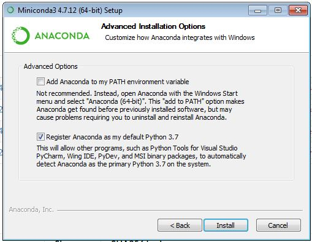
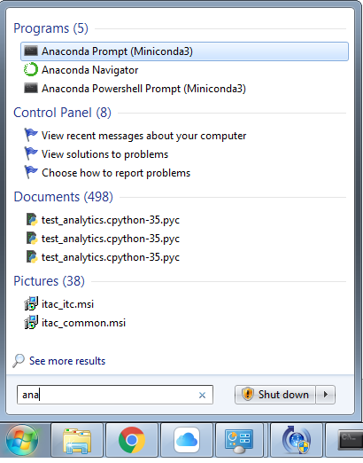
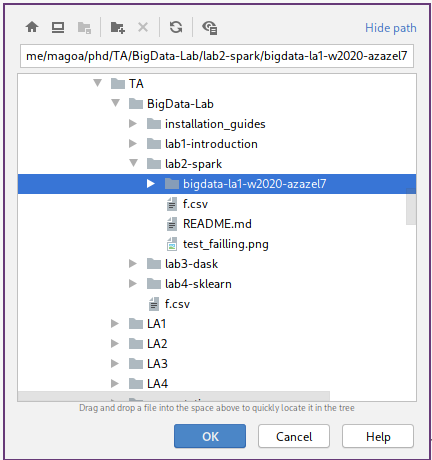
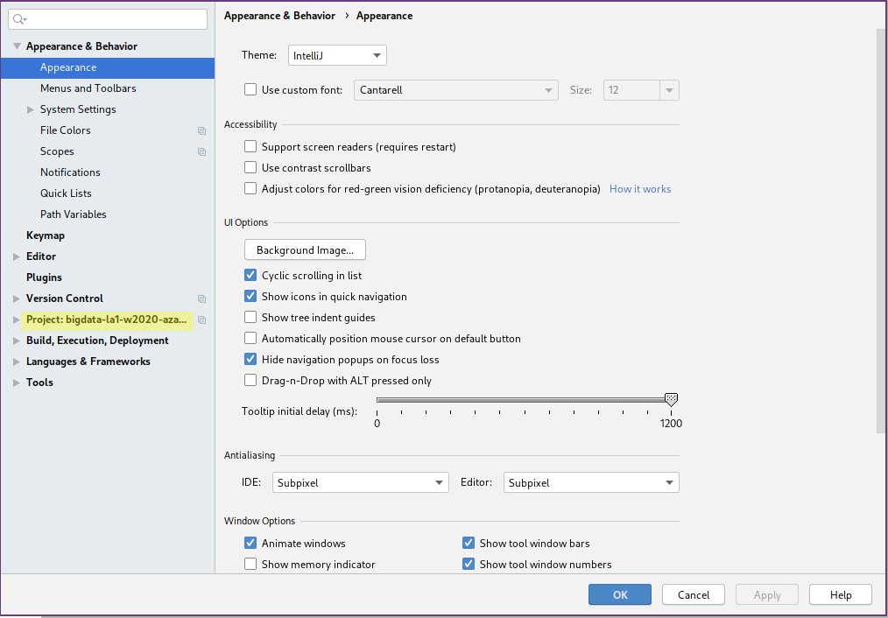
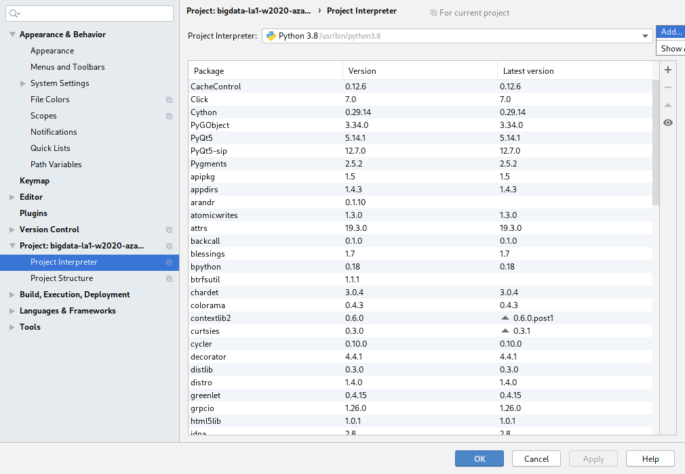
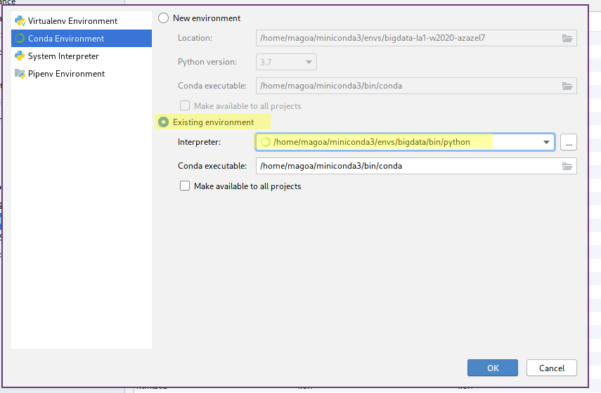
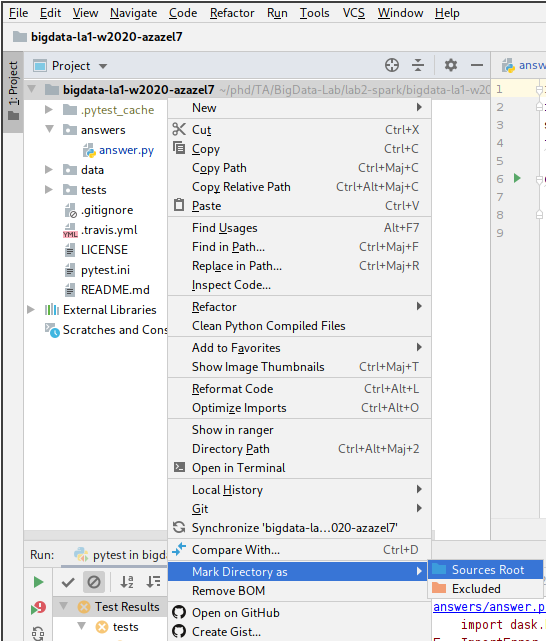
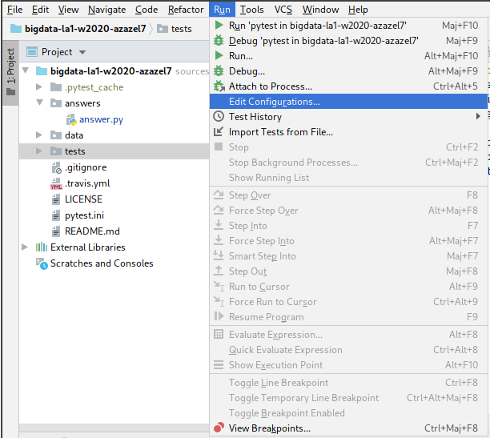
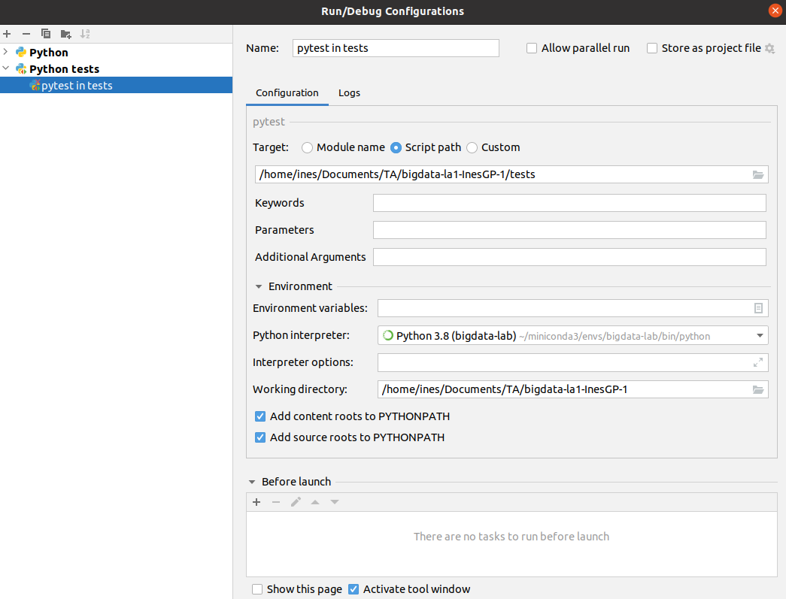
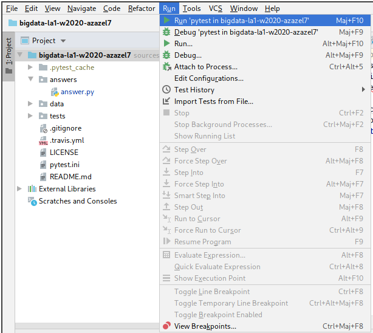

## Set up guide

This document is intended to provide you with the details for how to install and
configure conda, python, pip, pytest, pyspark and dask.
Note: these instructions were tested on Ubuntu 18.04.3.


### Installing Conda

Conda is an open-source package management system and environment management system that runs on
Windows, macOS, and Linux. We will use Conda to create a virtual environment with python3.5,
PySpark, Dask and PyTest.

<details>
<summary>Linux</summary>

1. Download Miniconda for Linux by executing the following command:
   Note: Use `curl -O` if `wget` is not installed on your system.

```
    wget https://repo.anaconda.com/miniconda/Miniconda3-latest-Linux-$(uname -i).sh
```
2. Grant execution rights to the installer with the command
   `chmod +x Miniconda3-latest-Linux-$(uname -i).sh`.
3. Execute the installer by executing the command `./Miniconda3-latest-Linux-$(uname -i).sh`.
   Press ENTER and scroll through the license agreement by pressing SPACE. If you accept the
   license agreement type `yes` and press ENTER. Enter the path where you want to install anaconda
   on your computer (for example `~/.condainstallation`). Finally, type `yes` to let the installer
   initialize conda.
4. Open a new terminal or reinitialize your shell with the command `source ~/.bashrc`.
5. To prevent conda from activating the default environment whenever you open a shell, use the
   following command: `conda config --set auto_activate_base false`.
6. Execute the command `conda update -y -n base -c defaults conda` to update conda to its latest
   version.
7. Congrats! You have successfully installed conda.

</details>

<details>
<summary>macOS</summary>

1. Download Miniconda for Linux by executing the following command:
   Note: Use `curl -O` if `wget` is not installed on your system.

```
    wget https://repo.anaconda.com/miniconda/Miniconda3-latest-MacOSX-$(uname -m).sh
```
2. Grant execution rights to the installer with the command
   `chmod +x Miniconda3-latest-MacOSX-$(uname -m).sh`.
3. Execute the installer by executing the command `./Miniconda3-latest-MacOSX-$(uname -i).sh`.
   Press ENTER and scroll through the license agreement by pressing SPACE. If you accept the
   license agreement type `yes` and press ENTER. Enter the path where you want to install anaconda
   on your computer (for example `~/.condainstallation`). Finally, type `yes` to let the installer
   initialize conda.
4. Open a new terminal.
5. To prevent conda from activating the default environment whenever you open a shell, use the
   following command: `conda config --set auto_activate_base false`.
6. Execute the command `conda update -y -n base -c defaults conda` to update conda to its latest
   version.
7. Congrats! You have successfully installed conda.

</details>

<details>
<summary>Windows</summary>

1. Download Miniconda (Python 3.7 version) from this webpage:
   `https://docs.conda.io/en/latest/miniconda.html`
2. Execute the installer and follow instructions

3. Access your Start Menu and search for the Anaconda Prompt

4. Execute the command `conda update -y -n base -c defaults conda` inside the Anaconda Prompt to
   update conda to its latest version.
5. Congrats! You have successfully installed conda.

</details>

### Creating a virtual environment

Conda can be used to create environments. A conda environment is a directory that contains a
specific collection of conda packages. They make it possible to have different versions of python
and python packages installed on the same system in different environments.

1. Create a virtual environment with python 3.5 by executing the command: 
   `conda create -y -n bigdata-lab python=3.5 -y`
2. Activate your virtualenv by executing the command: `conda activate bigdata-lab`


### Installing PySpark inside your virtual environment

PySpark is the Python API in Apache Spark. It is required to complete the course assignments.
In this section, we will install Apache Spark into the virtual environment that we
have just created.

1. With your venv activated, we will execute the command `conda install -y pyspark`.
   Apache Spark uses the language Scala which requires the Java Platform to run. If java is not
   already installed on your system, you can easily install it using conda.
   To check whether java is installed use `java -version`, and to install the java platform if
   necessary you can use the command: `conda install -y openjdk`.
   OpenJDK is a free and open-source implementation of the Java Platform
3. Execute the command `pyspark` to start the PySpark interpreter.
4. Run the following commands:

```
data = [i for i in range(10)]
rdd = spark.sparkContext.parallelize(data)
rdd.filter(lambda x: x%2 == 0).collect()
```
5. The output of the last command should be *[0, 2, 4, 6, 8]*.
   Use exit() (all systems) or Ctrl-D (Linux and MacOS only) to exit the interpreter.
6. Congrats! You have successfully installed PySpark.


### Installing Dask inside your virtual environment

Dask is a Big Data framework just like Apache Spark. However, unlike Spark, it is
entirely Python-based and does not require a JVM to execute its Python pipelines.

1. With your venv activated, we will execute the command `conda install -y dask` in the Command
   Prompt.
2. If no errors have occurred during the process, Dask has been successfully installed.


### Installing Pytest inside your virtual environment

Pytest is a Python framework that allows you to write test cases for Python applications.
We will be using Pytest to evaluate your assignment solutions.

1. With your venv activated, we will execute the command `conda install -y pytest` in the Command
   Prompt.
2. Execute the command `pytest --version` to ensure pytest has successfully been installed.

### Installing Git inside your virtual environment

Git is a version-control system for tracking changes in source code during development.

1. With your venv activated, we will execute the command `conda install -y git` in the Command
   Prompt.
2. Execute the command `git version` to ensure git has successfully been installed.

Congrats! Your system is now configured for the course.
Make sure that your virtual environment is always activated to access the installed resources,
otherwise, you will find that they are missing.

If you would like to exit your virtual environment, entering the command `conda deactivate`
will do it.

### Installing PyCharm

PyCharm is an Integrated Development Environment (IDE) that may facilitate your development in Python.

1. Install the virtual environment using Conda as explain before.
2. Clone your assignment repository using `git clone`.
3. Install PyCharm
	- Archlinux: `sudo pacman -S pycharm-community-edition`
	- Windows: Download from [here](https://www.jetbrains.com/pycharm/download/#section=windows) then run the installer.
	- Linux: Download from [here](https://www.jetbrains.com/pycharm/download/#section=linux) then run the installer.
	- MacOSX: Download from [here](https://www.jetbrains.com/pycharm/download/#section=mac) then run the installer.
4. Open PyCharm then open you project.



5. Change the environment for the project.
	1. File > Settings > Pick your project.
	

	2. Add a new interpreter.
	

	3. Conda Environment > Existing Environment > Select the environment you have created in Conda.
	

6. Mark the root directory of the project as the root.


7. Edit configuration of the tests so the working directory when pytest is run is the root.




8. Run pytest.

