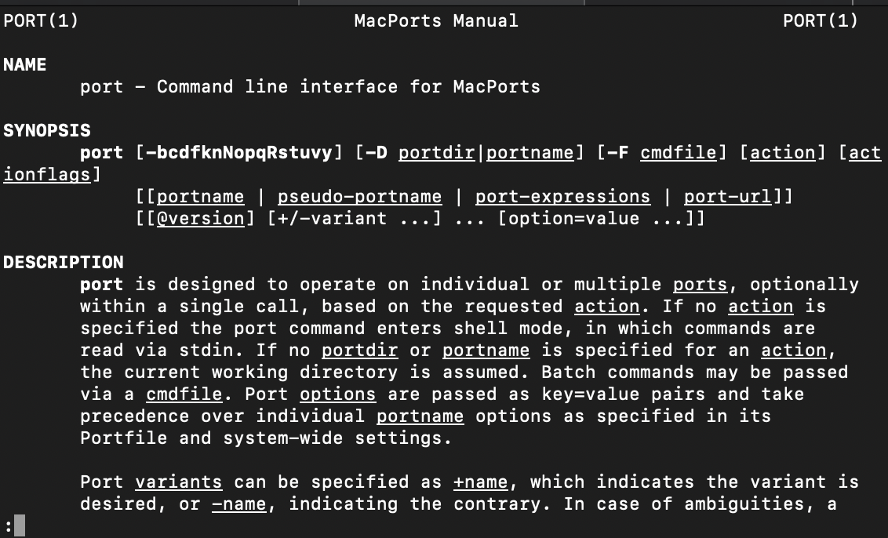
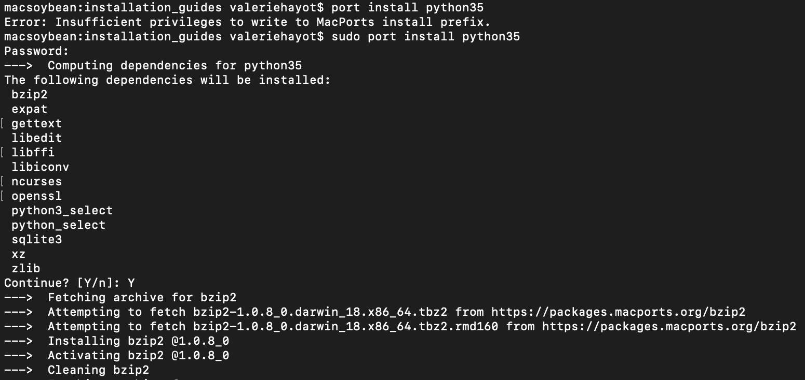
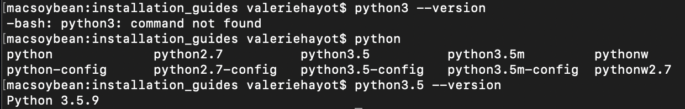
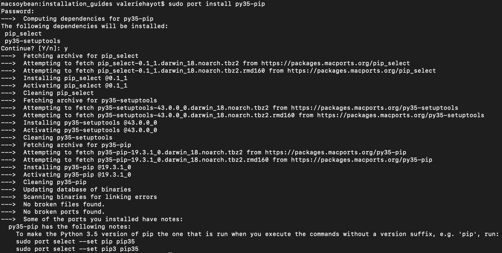
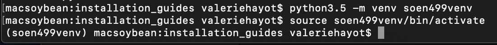
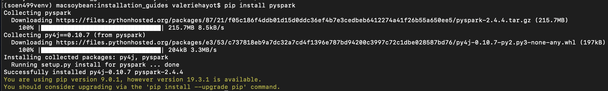
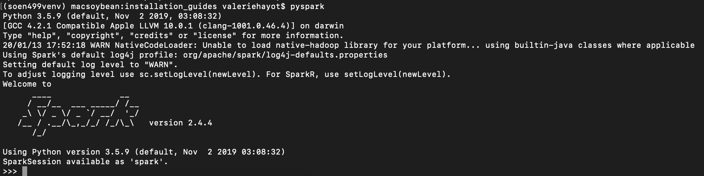

## Set up guide for Mac OSX

This document is intended to provide you with the details for how to install and
configure
python, pip, venv, pytest, pyspark and dask.
Note: these instructions were tested on macOS Mojave (10.14.6)


### Installing MacPorts

**Only necessary for installing Python3.5/Pip/Java. Skip if they are already installed**
- To check if Python3 is installed, enter `python3 --version` in your terminal
Note: it may be possible that `python3` is not mapped to any version of python, yet Python3 is in fact
installed on your system. After typing `python3` into your terminal click the `tab` key to see if anything pops up.
- To check if pip is installed, execute the command `pip3 --version`
- To check if Java is installed, execute the command `java -version`


MacPorts is a package manager for Macs. Another popular Mac-based package
manager is . Either work for the purposes of this
course, so if you're already using Homebrew, you may continue to use it.
Note: MacPorts requires sudo priviledges. Instructions for how to install MacPorts without
sudo are available (untested).


1. First install Xcode following . Warning: This may take a while.
2. Download and run the macOS Package installer for your macOS distribution
from .
3. Open your Terminal and type `man port` to see if MacPorts has successfully been installed.
Note: If running the command returns `No manual entry for port`, restart your
Terminal and try again or try sourcing one of the following configuration files
(if they exist): `.profile`, `.bash_login`, `.bash_profile`, `.tcshrc`, or `.cshrc`.
This can be achieved using the command `source ~/<configuration_file>`
e.g. `source ~/.profile`.
If that does not work, set your PATH environment variable as
described .



4. Congrats! You have just installed MacPorts.

### Installing Python 3.5 (3.5.9)

Note: This exact version of Python might differ from the other OS guides, which all use the latest
version of Python 3.5 available for the respective OS. All versions of Python 3.5 are fine for completing the
assignments. You should always double check your run on Travis before the assignment deadline, however.

1. Execute the command `sudo port install python35` in your Terminal.



2. Check if Python 3.5 has been installed by executing the following command: `python3.5 --version`.



3. Congrats! You have successfully installed Python3.5.


### Installing Pip

Pip is Python's package manager. We will use it to install PySpark, Dask and Pytest.

1. Execute the command `sudo port install py35-pip`.



2. Check if Pip has been successfully installed by executing the command `pip-3.5 --version`.


3. Congrats! You have successfully installed Pip.

### Creating a virtual environment

Venv provides an isolated environment for all Python project packages to reside in. It is a preinstalled module
in Python versions 3.5+, and therefore, does not need to be installed.

1. Create a virtual environment by executing the command: `python3.5 -m venv <your venv directory path>`
2. Activate your virtual environment by executing the command: `source <venv directory path>/bin/activate`



### Installing Java JDK 8

As PySpark relies on the JVM, it is necessary to have Java installed on your machine. Spark's latest release
(Spark 2.4.4) requires Java 8 to run.

1. Execute the command `sudo port install openjdk8`
2. Check that Java has been successfully installed by executing the command `java -version`


### Installing PySpark inside your virtual environment

PySpark is the Python API in Apache Spark. It is required to complete the course assignments.
In this section, we will install Apache Spark into the virtual environment that we
have just created.

1. With your venv activated, we will execute the command `pip install pyspark`



2. Execute the command `pyspark` to start the PySpark interpreter.



3. Run the following commands

```
data = [i for i in range(10)]
rdd = spark.sparkContext.parallelize(data)
rdd.filter(lambda x: x%2 == 0).collect()
```

4. The output of the last command should be *[0, 2, 4, 6, 8]*
5. Congrats! You have successfully installed PySpark.


### Installing Dask inside your virtual environment

Dask is a Big Data framework just like Apache Spark. However, unlike Spark, it is
entirely Python-based and does not require the JVM to execute its pipelines.


1. With your venv activated, execute the following command in your terminal: `pip install "dask[complete]"
2. If not errors have occurred during the process, Dask has been successfully installed.

### Installing Pytest inside your virtual environment

Pytest is a Python framework that allows you to write test cases for Python applications.
We will be using Pytest to evaluate your assignment solutions.

1. With your venv activated, we will execute the command `pip install pytest` in the terminal.
2. Execute the command `pytest --version` in you terminal to ensure Pytest has successfully been installed.


Congrats! Your system is now configured for the course. Make sure that your virtual environment is activated when running
examples to access the installed packages, otherwise they will be missing.

If you would like to exit your virtual environment, simply close your terminal window or enter the command `deactivate` in your terminal.
