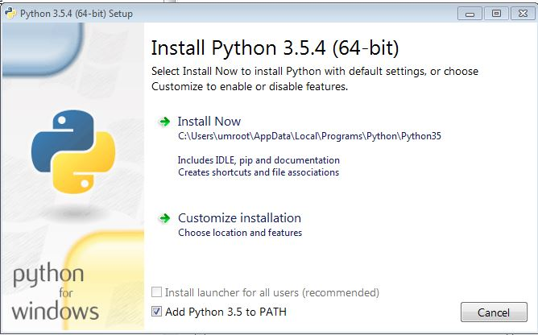
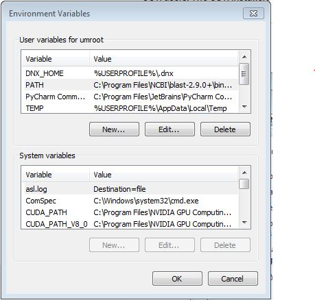
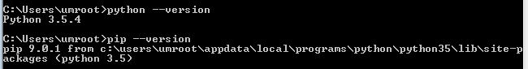
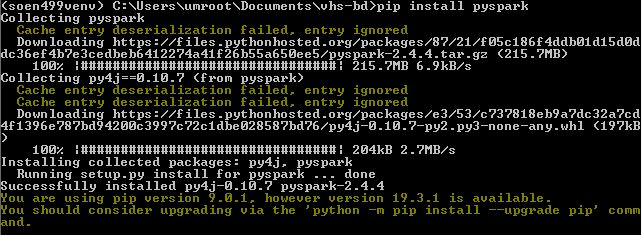
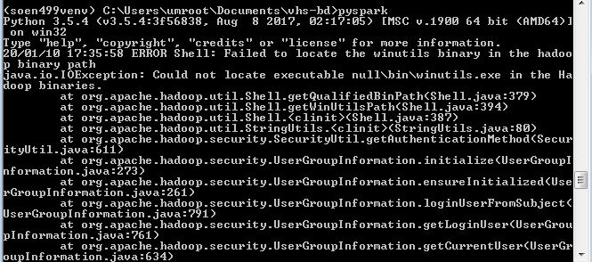
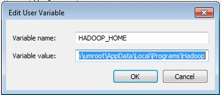

## Set up guide for Windows

This document is intended to provide you with the details for how to install and
configure
python, pip, venv, pytest, pyspark and dask.
Note: these instructions were tested on Windows 7 Enterprise and Windows 10 both with Java 1.8.0 
installed. Please submit a PR to update this document for alternate versions of Windows and/or Java.


### Installing Python version 3.5.4

0. Check if Python is installed on your computer by opening a Command Prompt and typing `python --version`.
   If Python is installed and you have a version of Python3+, you may skip the following steps and move on to the next section.
1. Download the Python 3.5.4 web-based installer from [here](https://www.python.org/downloads/release/python-354/)
2. Execute installer and make sure to select "Add Python 3.5 to PATH" and click `Install Now`

  - If you have accidentally omitted to add Python to your PATH:
    1. Start menu
    2. Control Panel
    3. User Accounts
    4. Change my environment variables (last option on the lefthand-side menu or search "Edit environment variables")
    5. Click on `New...` under `User variables for <your username>`
    
    6. Set variable name to `PYTHONHOME` and variable value to the path of your newly extracted 
       Python directory (e.g. `C:\Users\umroot\AppData\Local\Programs\Python\Python35`)
    7. Press `Ok`
    8. Select `PATH` under `User variables for <your username>` and click `Edit...`. If it doesn't exist, create it by clicking `New...`!
    9. Add the previously created PYTHONHOME variable to your PATH along with its Scripts folder
       (e.g. `%PYTHONHOME%;%PYTHONHOME%\Scripts`). Note: Don't erase the other values
       in the PATH variable, just **prepend** to the list using a semi-colon before entering the Python executable path.
    10. Press OK on both screens to finalize the changes.
4. You should now be able to open your Command Prompt and enter `python --version` to obtain the
   installed Python version, as well as, `pip --version` to obtain the installed version of the Python
   package manager.
   
5. Congrats! You have successfully installed Python 3.5.4 on your Windows machine.


### Creating a virtual environment

Venv provides an isolated environment for all Python project packages to reside in.
It is a preinstalled module in Python versions 3.5+, and therefore, does not need to be installed.

1. Create a virtual environment by executing the command: `python -m venv <your venv directory path/name>`
(e.g. `python -m venv soen499venv`)
2. Activate your virtualenv by executing the command: `<venv directory path>/Scripts/activate`
(e.g. `soen499venv\Scripts\activate`)


### Installing PySpark inside your virtual environment

PySpark is the Python API in Apache Spark. It is required to complete the course assignments.
In this section, we will install Apache Spark into the virtual environment that we
have just created.

1. With your venv activated, we will execute the command `pip install pyspark`.

- You have just installed PySpark, however, there will still be bugs if you try to access the PySpark interpreter.

2. Download winutils.exe from [here](http://public-repo-1.hortonworks.com/hdp-win-alpha/winutils.exe)
3. Create a winutils folder to copy the executable to it (e.g. `C:\Users\umroot\AppData\Local\Programs\Hadoop\bin\winutils.exe`)
4. Create a new environment variable and name it `HADOOP_HOME`. Set the variable value to the path of the `Hadoop` directory.
Note: If you don't know how to set environment variables, see step 2.1 of installing Python.

5. Restart your Command Prompt, activate your virtual environment and execute the command `pyspark` to start the PySpark interpreter.


6. Run the following commands:

```
data = [i for i in range(10)]
rdd = spark.sparkContext.parallelize(data)
rdd.filter(lambda x: x%2 == 0).collect()
```
7. The output of the last command should be *[0, 2, 4, 6, 8]*
8. Congrats! You have successfully installed PySpark.


### Installing Dask inside your virtual environment.

Dask is a Big Data framework just like Apache Spark. However, unlike Spark, it is
entirely Python-based and does not require a JVM to execute its Python pipelines.

1. With your venv activated, we will execute the command `pip install "dask[complete]"` in the Command Prompt.
2. If no errors have occurred during the process, Dask has been successfully installed.


### Installing Pytest

Pytest is a Python framework that allows you to write test cases for Python applications.
We will be using Pytest to evaluate your assignment solutions.

1. With your venv activated, well will execute the command `pip install pytest` in the Command Prompt.
2. Execute the command `pytest --version` in your Command Prompt to ensure pytest has successfully been installed.


Congrats! Your system is now configured for the course. Make sure that your virtual environment is always activated to
access the installed resources, otherwise you will find that they are missing.

If you would like to exit your virtual environment, entering the command `deactivate` into your Command Prompt will do it.


 


